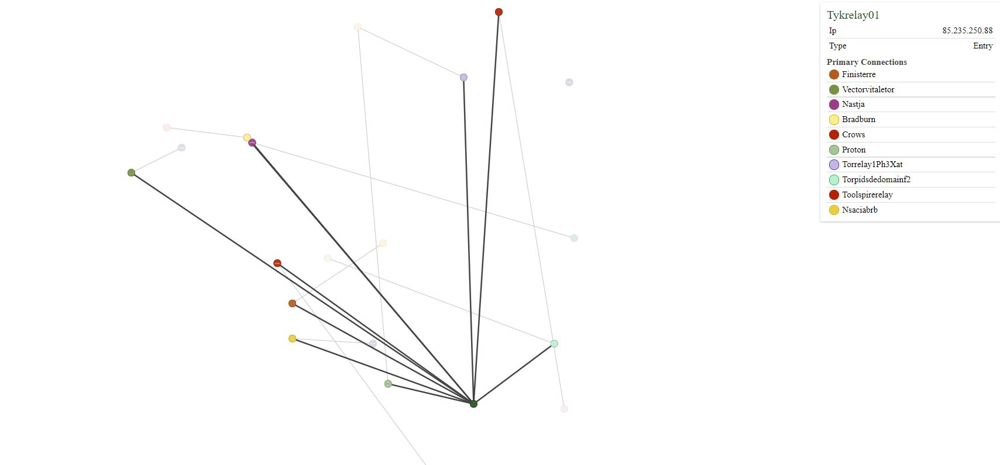
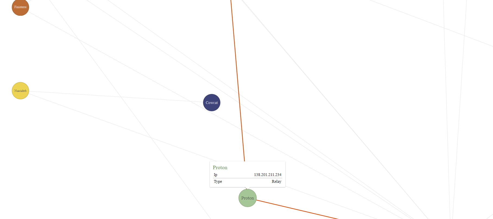

# TOR-Network-Visualization

Visualizes a static TOR (Anonimity) network from a JSON representation of a consensus document.

<html>
  
Sample image of nodes in the network - their names appear on the top right

  </img>
   
 
  
 Sample image of simple node information - IP and type - edges indicate connections to other nodes 

   </img>
</html>  
